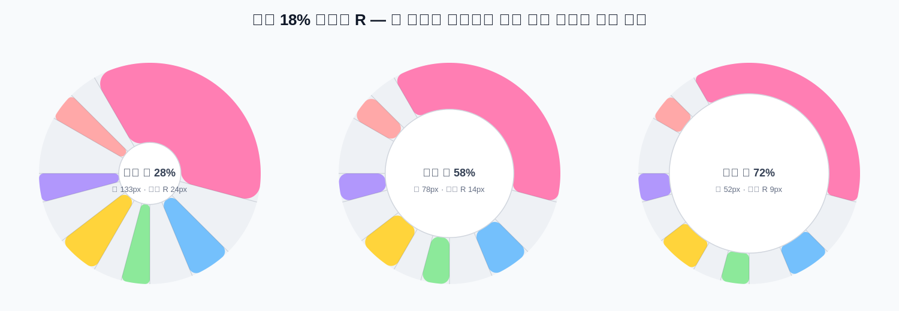
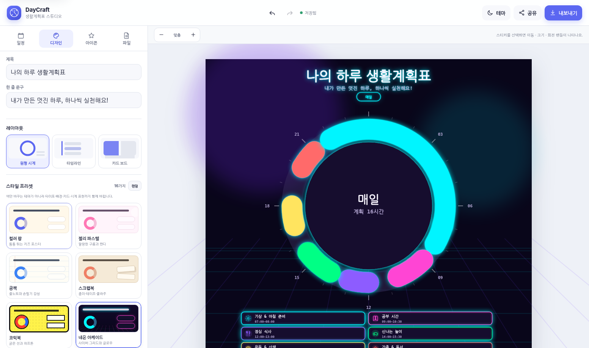
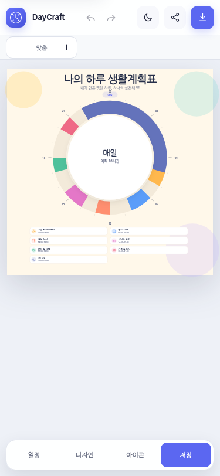
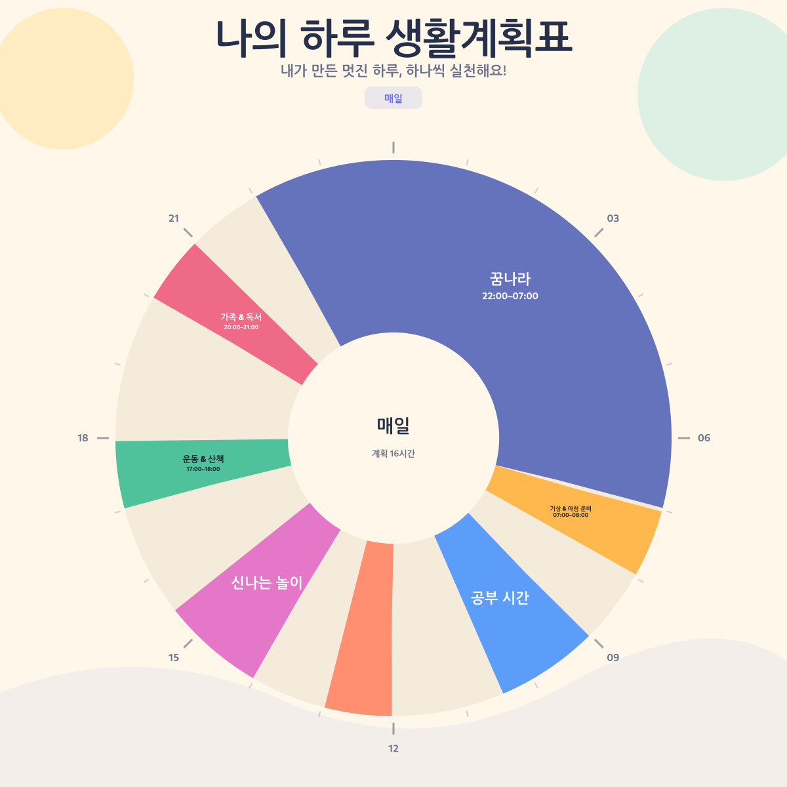

# DayCraft 생활계획표 스튜디오

[](https://github.com/ko9ma7/daycraft-planner/actions/workflows/deploy.yml)

**Live Demo:** https://ko9ma7.github.io/daycraft-planner/  
**Repository:** https://github.com/ko9ma7/daycraft-planner

아이들이 직접 일정과 시간을 입력하고, 디자인·아이콘·스티커를 꾸민 뒤 **PNG / JPG / WebP / SVG / PDF / 인쇄**로 내보내거나 **편집 가능한 링크**로 공유할 수 있는 GitHub Pages용 정적 웹서비스입니다.

기존 `계획표.html`의 일정 추가·수정·삭제, 원형 생활계획표, CSV, LocalStorage 기능을 유지하면서 편집기형 UI로 다시 설계했습니다.

## v2.6 편집 패널 안정화

- 일정 추가/수정/복제/삭제, 요일 전환, 디자인 토글·슬라이더 변경 뒤에도 현재 편집 패널과 스크롤 위치를 유지합니다.
- 편집 패널 상태를 명시적으로 관리해 패널 내용이 통째로 사라지는 회귀를 막았습니다.
- GitHub Pages/PWA에서 이전 JavaScript·CSS가 남는 문제를 막기 위해 정적 자산 버전과 Service Worker 캐시 전략을 갱신했습니다.
- 새 배포 후에는 최신 자산을 네트워크에서 우선 확인하고, 오프라인일 때만 캐시로 폴백합니다.
- **v2.5 이하에서 이미 사이트를 열었던 브라우저는 v2.6 배포 직후 한 번 `Ctrl+Shift+R`(모바일은 탭을 닫았다 다시 열기)을 권장합니다.** 이전 Service Worker 캐시를 즉시 교체하기 위한 1회 조치이며, v2.6 이후에는 버전 캐시가 자동 갱신됩니다.

## v2.5 R-필렛 원형 엔진

- 둥근 일정 조각을 `stroke-linecap: round` 같은 고정 원형 캡으로 만들지 않고, **외곽 원·각도 경계선·내곽 원 사이에 실제 R(필렛 반지름)을 계산한 SVG 경로**로 렌더링합니다.
- `모서리 R`은 픽셀 고정값이 아니라 **현재 원형 띠 두께의 비율(0~40%)**입니다. 내측 원을 키워 띠가 얇아지면 R도 함께 작아지고, 띠가 두꺼워지면 같은 비율로 커집니다.
- 일정 시간이 짧아 각도 폭이 좁은 경우에는 해당 시작/종료 각도 안에서 들어갈 수 있는 최대 R로 자동 제한합니다. **둥근 모서리가 옆 시간 구간을 침범하지 않습니다.**
- 각 일정의 시작각·종료각 자체는 R과 무관하게 고정됩니다. 1시간은 항상 15°, 90분은 항상 22.5°입니다.
- 각진 디자인은 R=0, 젤리/레트로/글래스 계열은 적당한 R을 스타일 프리셋이 자동 적용하며, 사용자가 직접 조절할 수도 있습니다.



## v2.4 Strict Sector Geometry

- 일정 색상은 **시작/종료 시간의 정확한 각도 구간**을 그대로 사용합니다. 1시간은 항상 15°, 90분은 항상 22.5°입니다.
- `경계선 두께`는 일정 각도를 줄이지 않습니다. 색상 위에 얇은 분리선을 그릴 뿐이라 시간 비율은 보존됩니다.
- 내측 원을 조절해도 바깥 반지름과 모든 시작/종료 각도는 고정됩니다.
- 네온/그림자 효과도 일정 색상 면에는 적용하지 않아 인접 시간 구간으로 색이 번지지 않습니다.
- 원 안 텍스트는 해당 일정의 정확한 부채꼴 영역으로 clip됩니다.

## v2.3 원형 기하 엔진

- 24시간을 360°로 고정 환산하며 모든 일정 조각은 `시작각 → 종료각` 범위를 절대 벗어나지 않습니다.
- 원형 조각을 두꺼운 stroke가 아닌 **annular sector(도넛 부채꼴) 경로**로 렌더링해, 띠가 두꺼워져도 양끝이 알약처럼 부풀거나 서로 침범하지 않습니다.
- `안쪽 빈 원`은 외곽 반지름과 무관하게 안쪽 경계만 움직입니다. 따라서 외곽 지름·시간 눈금·시작/종료 각도는 그대로 유지됩니다.
- 원 안 글자는 띠 두께와 별도의 크기를 가지며, 공간이 좁을 때만 축소/생략됩니다. 커진 띠 때문에 글자까지 커지지 않습니다.
- 원 안 글자는 각 일정의 부채꼴 영역으로 clip되어 다른 시간 구간을 침범하지 않습니다.
- 중앙 요약 글자도 안쪽 원 확대에 따라 커지지 않고, 공간이 부족할 때만 축소됩니다.
- 디자인 패널의 활성 탭을 렌더링 후에도 다시 동기화해 토글 조작 중 패널이 사라지는 현상을 방지합니다.

## Windows 원클릭 GitHub 배포

압축을 푼 프로젝트 폴더에서 **`배포하기.cmd`를 더블클릭**하면 다음 작업을 자동으로 처리합니다.

1. Git / GitHub CLI가 없으면 Windows `winget`으로 설치
2. GitHub CLI 로그인 상태 확인 (`gh auth login --web`)
3. `daycraft-planner` 공개 저장소가 없으면 생성
4. 프로젝트 전체를 `main` 브랜치에 커밋하고 push
5. Repository About의 설명 / Website / Topics 설정
6. GitHub Pages를 `GitHub Actions` 방식으로 활성화
7. `.github/workflows/deploy.yml` 실행 및 완료 여부 확인
8. 저장소와 실제 Pages 주소를 브라우저로 열기

이미 저장소가 존재해도 재실행할 수 있습니다. 기존 원격 `main`에 DayCraft 커밋이 이미 있으면 먼저 원격 이력을 연결한 뒤 현재 파일을 새 커밋으로 올립니다. **강제 push는 사용하지 않으므로** 기존 이력을 지우지 않습니다.

기본 배포 목표:

```text
Repository:   https://github.com/ko9ma7/daycraft-planner
GitHub Pages: https://ko9ma7.github.io/daycraft-planner/
```

배포가 끝나면 프로젝트 루트에 `DEPLOY_RESULT.txt`가 생성됩니다.

## Preview



모바일에서는 미리보기를 크게 유지하고, 하단 도구 버튼으로 편집 패널을 열어 사용합니다.



### Adaptive Clock Composer



`원 안 텍스트` 빠른 구성을 선택하면 내측 원을 줄여 색상 밴드를 넓히고, 일정명과 시간을 원형 안에 직접 넣을 수 있습니다. 짧은 일정은 자동 기준 또는 일정별 설정으로 라벨을 숨길 수 있습니다.

## Features

- 일정 추가 / 수정 / 삭제 / 복제
- `매일` 또는 월~일 다중 요일 지정
- 자정 넘김 일정 지원 (예: 22:00 - 07:00)
- 동일 요일 시간 중복 검사
- 3개 출력 레이아웃: 원형 시계 / 타임라인 / 카드 보드
- 캔버스 비율 자동 대응 원형 레이아웃: 정사각 / 세로 / 스토리 / A4 / 와이드에서 원형·범례를 자동 재배치
- 원형 크기 / 내측 원 크기 / 세로 위치 / 조각 간격 직접 조절
- 색상 조각 안에 일정명·시간·아이콘을 넣는 **원 안 일정 라벨**
- 짧은 일정 라벨 자동 생략 시간 조절 + 일정별 개별 라벨 숨김
- 원 안 라벨 방향(호를 따라 / 수평), 중앙 내용, 빈 시간 트랙, 범례 위치 옵션
- 원형 빠른 구성 4종: 균형 / 원 안 텍스트 / 미니멀 / 원형 강조
- 16개 풀 스타일 프리셋: 컬러 팝 / 젤리 파스텔 / 공책 / 스크랩북 / 코믹북 / 네온 아케이드 / 블루프린트 / 칠판 / 에디토리얼 / 브루탈 / 70s 레트로 / 픽셀 게임 / 오로라 글래스 / 보태니컬 / 스위스 미니멀 / 별자리 밤
- 제목, 부제, 강조색, 시간 눈금, 상세설명, 범례 설정
- 스타일 변경 시 색만 바뀌는 것이 아니라 배경 패턴, 타이포, 카드 구조, 테두리, 그림자, 시계 링 표현까지 함께 변경
- 내장 SVG 아이콘과 드래그 가능한 스티커
- 선택한 스티커의 캔버스 직접 조작: 이동 / 모서리 크기 조절 / 회전 핸들 / 복제 / 앞뒤 순서
- 사용자 SVG 파일 / SVG 코드 가져오기 (위험 요소를 제거한 제한적 SVG만 허용)
- 자동 저장 + 새로고침 후 마지막 작업 복원
- 실행 취소 / 다시 실행 (Ctrl/Cmd+Z, Ctrl/Cmd+Y)
- 기존 `summerVacationSchedules` LocalStorage 데이터 자동 마이그레이션
- 프로젝트 JSON 백업/복원
- CSV 내보내기/불러오기
- PNG / JPG / WebP / SVG / PDF 저장
- 브라우저 인쇄
- 현재 편집 상태를 URL에 압축해 넣는 편집 가능한 공유 링크
- Light / Dark / System 화면 테마
- PWA 기본 구성 및 핵심 파일 오프라인 캐시
- 반응형 UI (모바일 / 태블릿 / 데스크톱)
- GitHub Pages Actions 자동 배포
- favicon / app icon / Apple Touch Icon / OG image / Social Preview / 404 / robots / sitemap

## v2.2 Adaptive Clock Composer

원형 계획표를 고정 좌표 방식에서 **캔버스 비율에 따라 다시 계산되는 레이아웃 엔진**으로 변경했습니다.

- 화면 비율이 달라져도 제목·원형·시간 눈금·범례의 사용 가능 영역을 다시 계산
- 내측 원 비율을 줄이면 색상 밴드가 두꺼워져 활동 내용을 원 안에 배치 가능
- 너무 짧은 시간은 설정한 분 기준으로 라벨을 자동 생략
- 특정 일정만 `원형 라벨 숨기기`로 제외 가능
- 스티커 크기도 캔버스의 짧은 변을 기준으로 보정되어 비율 변경 시 상대 크기가 크게 틀어지지 않음
- 원형 라벨은 제목 / 제목+시간 / 아이콘+제목, 자동 회전 / 수평 표시를 선택 가능

## 공유 링크 방식

GitHub Pages는 정적 호스팅이라 데이터베이스가 없습니다. DayCraft는 편집 상태를 URL의 `#share=` 부분에 압축하여 넣습니다.

1. `공유` 버튼을 누릅니다.
2. 링크를 복사하거나 기기 공유 기능을 사용합니다.
3. 받은 사람이 링크를 열면 같은 계획표가 로드됩니다.
4. 받은 사람은 자유롭게 수정하고 다시 새 링크를 만들 수 있습니다.

이 방식은 **실시간 공동 편집**이 아니라 **편집 가능한 복사본 공유**입니다. 일정/사용자 SVG가 너무 많으면 링크가 길어질 수 있으므로 JSON 백업도 함께 사용할 수 있습니다.

## 아이콘과 Koboyo

Koboyo Icons는 일반 웹/문서 안에서 사용하는 것은 허용하지만, 아이콘을 사용자가 골라 추출·내보낼 수 있는 편집기나 아이콘 라이브러리에 아이콘 묶음을 내장하는 것은 라이선스상 제한됩니다. 따라서 DayCraft에는 자체 제작한 단순 SVG 아이콘을 넣고, 사용자가 합법적으로 확보한 SVG를 **직접 가져오기**로 추가할 수 있게 했습니다.

Koboyo: https://koboyo.com/icons

## Tech Stack

- HTML5
- CSS3
- Vanilla JavaScript ES6+
- SVG 기반 렌더러 (별도 차트 라이브러리 없음)
- Canvas API (PNG/JPG/WebP)
- 브라우저 Blob API
- 자체 JPEG-in-PDF writer (외부 PDF 라이브러리 없음)
- LocalStorage
- Service Worker / Cache Storage
- GitHub Actions + GitHub Pages

런타임 dependency가 없어 초기 로딩과 GitHub Pages 배포가 단순합니다.

### v2.1 스타일 엔진

`PRESETS`는 단순 컬러 팔레트가 아니라 포스터 전체의 시각 언어를 정의합니다. 각 프리셋은 배경 패턴, 헤더 구성, 글꼴 계열, 카드 모양, 테두리 두께, 그림자 방식, 일정 팔레트, 원형 시계의 캡 스타일을 함께 바꿉니다. 새 스타일은 `src/js/app.js`의 `PRESETS`에 추가하면 됩니다.

## Project Structure

```text
/
├─ src/
│  ├─ assets/
│  │  ├─ favicon.svg
│  │  ├─ favicon-32.png
│  │  ├─ apple-touch-icon.png
│  │  ├─ icon-192.png
│  │  ├─ icon-512.png
│  │  ├─ og-image.png
│  │  └─ social-preview.png
│  ├─ css/app.css
│  ├─ js/
│  │  ├─ app.js
│  │  └─ icons.js
│  ├─ 404.html
│  ├─ index.html
│  ├─ manifest.webmanifest
│  ├─ robots.txt
│  ├─ sitemap.xml
│  ├─ sw.js
│  └─ .nojekyll
├─ scripts/
│  ├─ build.mjs
│  └─ dev.mjs
├─ screenshots/
├─ .github/workflows/deploy.yml
├─ scripts/deploy-github.ps1
├─ 배포하기.cmd
├─ .gitignore
├─ GITHUB_SETUP.md
├─ package.json
├─ LICENSE
└─ README.md
```

## Local Development

Node.js 20+가 필요합니다. 외부 npm 패키지는 없습니다.

```bash
npm run dev
```

기본 주소:

```text
http://127.0.0.1:4173/
```

## Build

```bash
npm run build
```

결과는 `dist/`에 생성됩니다.

전체 정적 검사와 빌드:

```bash
npm run check
```

## GitHub Pages Deployment

### 권장: Windows 원클릭 배포

프로젝트 루트의 `배포하기.cmd`를 더블클릭합니다. 최초 1회 GitHub 로그인이 필요하면 GitHub CLI가 공식 브라우저 인증 화면을 엽니다. 로그인 후 나머지는 자동으로 진행됩니다.

### 수동 배포

원클릭 스크립트를 사용하지 않는 경우 아래처럼 직접 배포할 수 있습니다.

```bash
git init
git add .
git commit -m "feat: launch DayCraft planner studio"
git branch -M main
gh repo create ko9ma7/daycraft-planner --public --source=. --remote=origin --push
```

Repository About 설정:

```bash
gh repo edit ko9ma7/daycraft-planner \
  --description "아이들이 직접 만들고 꾸미고 공유하는 생활계획표 스튜디오" \
  --homepage "https://ko9ma7.github.io/daycraft-planner/" \
  --add-topic kids --add-topic planner --add-topic schedule \
  --add-topic education --add-topic github-pages --add-topic pwa
```

Pages를 GitHub Actions 방식으로 활성화:

```bash
gh api --method POST repos/ko9ma7/daycraft-planner/pages -f build_type=workflow
```

이미 Pages가 존재하면 `POST` 대신 다음 명령으로 설정을 갱신할 수 있습니다.

```bash
gh api --method PUT repos/ko9ma7/daycraft-planner/pages -f build_type=workflow
```

`.github/workflows/deploy.yml`이 포함되어 있으므로 이후에는 `main`에 push할 때마다 자동으로 빌드·배포됩니다. `build.mjs`가 GitHub Actions의 `GITHUB_REPOSITORY`를 읽어 canonical, Open Graph URL, sitemap URL을 실제 저장소 경로에 맞게 생성합니다.

배포 주소:

```text
https://ko9ma7.github.io/daycraft-planner/
```

## Configuration

주요 설정은 `src/js/app.js` 상단에서 관리합니다.

- `CANVAS_SIZES`: 출력 비율/해상도
- `PRESETS`: 디자인 프리셋
- `QUICK_ACTIVITIES`: 빠른 일정 템플릿
- `src/js/icons.js`: 내장 SVG 아이콘

디자인 토큰과 앱 UI는 `src/css/app.css`의 `:root`에서 수정할 수 있습니다.

## Custom Domain

커스텀 도메인을 연결할 때는 `src/CNAME` 파일을 만들고 도메인만 한 줄로 적습니다.

```text
planner.example.com
```

그리고 GitHub의 `Settings → Pages → Custom domain`에서도 같은 도메인을 설정하고 HTTPS를 활성화하세요.

OG/canonical URL도 커스텀 도메인으로 고정하려면 GitHub Actions 빌드 단계에 환경 변수를 추가합니다.

```yaml
- run: npm run build
  env:
    SITE_URL: https://planner.example.com/
```

## Security / Privacy

- 일정 데이터는 기본적으로 현재 브라우저 LocalStorage에만 저장됩니다.
- 공유 버튼을 누를 때만 현재 상태가 링크에 포함됩니다.
- API key, 비밀번호, 토큰은 사용하지 않습니다.
- 사용자 SVG는 `script`, 이벤트 핸들러, 외부 URL 등을 허용하지 않는 제한적 화이트리스트 방식으로 정리합니다.
- 공유 링크에는 입력한 일정 내용이 포함되므로 개인정보나 민감한 정보를 넣지 않는 것을 권장합니다.

## Browser Support

최근 Chrome / Edge / Safari / Firefox를 목표로 합니다. 공유 링크 압축은 `CompressionStream`이 있으면 gzip을 사용하고, 없으면 비압축 JSON URL로 자동 대체합니다.

## License

프로젝트 코드는 MIT License입니다. 내장 아이콘은 이 프로젝트를 위해 직접 구성한 단순 SVG 도형입니다.

